# Promise based assertion framework

领域驱动设计（DDD）旨在软件设计过程中提炼领域模型，以领域模型为核心衔接领域和软件。领域驱动设计让面向对象的分析和设计进入了一个新的阶段，对企业级软件开发起到了巨大的推动作用。遗憾的是市面上关于领域驱动设计的书和例子使用的都是偏向应用侧的编程语言，如java、python等。下面以一个改编简化过的真实案例，和大家讨论一下如何使用C\++语言进行DDD设计。

## 问题

假设有一个智能电子玩具生产商，他们最新一代电动智能玩具汽车具有如下一些新功能：

- 可以通过遥控器设定玩具汽车沿着地面某条车道线行驶
- 可以根据遥控器的控制进行车道变换
- 行驶过程中如果发现前方有静止物体阻挡则会自动停车
- 行驶过程中如果发现前方有同方向低速移动物体则会自动跟随
- 其它特性

生产商已经有一套半自动测试环境用来对玩具汽车做测试。测试人员可以在电脑主机上提前编辑好对玩具汽车的遥控指令，然后通过无线网络对实验场地上的玩具汽车下发这串控制指令。而玩具汽车在行驶过程中会每隔100ms将自身状态通过无线网络上报给服务器，信息内容包含玩具车上各种传感器获取到的实时信息，例如当前的车速、和车道中心线的偏移距离以及和正前方物体的间距、是否发生碰撞等等。测试人员通过观察玩具汽车的行驶状态以及分析收集上来的消息log，人工判断每次测试车辆的行驶是否符合预期。

现在生产商想要开发一套断言系统，可以让测试人员来描述每个测试用例期望的玩具汽车行驶状态，然后断言系统在测试过程中会根据玩具汽车上报的状态消息实时判断汽车的运行状态和预期是否一致。

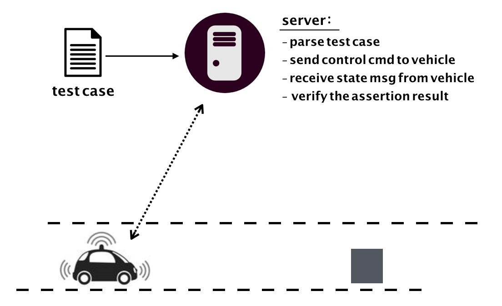

如上图所示，这套断言系统将被集成到原有的测试系统上，最终运行在同一台server上。至于如何遥控汽车和接收汽车的状态信息，不是我们的关注点。我们把重点放在实现这套断言系统上。这里选择使用C\++语言来实现，或许是为了更容易与原来的C\++系统进行集成，或许是考虑到计算的实时性和性能等原因。但无论如何现在让我们开始把关注点放到对断言系统的设计和实现上。

## 领域建模

### 初始模型

我们先来看断言系统的边界。

1. 系统需要提供一套DSL（领域专有语言），供玩具车测试人员来描述断言。
2. 系统会不断接收车辆状态消息。
3. 系统会根据车辆状态，实时进行断言判断，最终输出断言成功或者失败的信息。

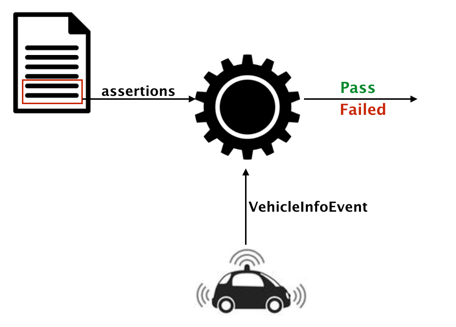

虽然给测试人员提供用来描述断言的DSL非常关键，但是[Martin Fowler](https://martinfowler.com/)在《[Domain-Specific Languages](https://martinfowler.com/books/dsl.html)》一书中明确说了，DSL只是对领域模型的一层封装而已，应该先有领域模型然后有DSL。所以这里我们先不着急设计DSL，我们先把核心放到领域建模上。

领域驱动开发强调使用领域模型来反映对领域本质的理解。针对要解决的问题，对领域进行抽象，提炼出核心领域概念和关系，围绕这组抽象可以去简单自洽地解决问题。

因此我们拿到优先级最高的两个需求，我们期望至少模型可以解决这两个需求，然后根据新的需求在逐步演进模型。

- 可以断言车辆在测试过程中没有发生过碰撞
- 可以断言车辆没有发生过变道

这时熟悉面向对象设计的同学能立即想到的一个设计就是实现一个`Vehicle`类，用来在软件中映射现实世界中的玩具汽车。Vehicle的对象可以一直接收车辆状态消息并存储断言关注的信息，随后提供接口供断言判断。

针对上面的系统边界，对于2我们已知车辆状态消息格式如下，Vehicle需要有一个处理该消息的接口。

~~~cpp
// every 100ms vehicle state msg
struct VehicleInfoEvent
{
    int id;            // unique ID for each vehicle
    bool collision;    // if true : vehicle is in collision
    int  laneId;       // current lane id of vehicle
    double speed;      // current speed of vehicle, unit : m/s
    double distance;   // current distance to the first object ahead, unit: m
    // ...
};
~~~

同时Vehicle需要有接口用来判断断言是否成功。现在根据需求有两种断言，所以针对性地Vehicle提供两个用于判断的接口，用来查询对应的断言状态。

~~~cpp
struct Vehicle
{
    void processEvent(const VehicleInfoEvent&);
    bool hasCollisionOccured() const;
    bool hasLaneChanged() const;

private:
    int id;
    bool collisionOccured{false};
    bool laneChanged{false};
    // other vehicle state
};

~~~

有了Vehicle之后，我们每收到一条玩具汽车上报的状态消息后，就交给它的`processEvent`去处理，然后再调用对应的判断接口`hasCollisionOccured`或`hasLaneChanged`，看车辆是否发生了撞击或者变道。

上述设计似乎已经很简单地解决了问题，因为面向对象告诉过我们有了对象就能容易地映射现实事物，对现实进行建模。

可是当我们观察Vehicle类，至少发现它有如下一些问题：

- Vehicle里的接口和属性是分属于不同的断言的，而现在却耦合在一个类里面。假如用户只断言了“没有发生过碰撞”，但事实上Vehicle却要负责携带和“是否变道”相关的接口和属性。
- 虽然不同断言是独立的，但是目前对不同断言的修改，都得在Vehicle内进行。
- 随着断言的增加，Vehicle势必变成上帝类。

虽然面向对象可以很容易地对现实进行建模，可绝不是刻板地映射现实。实践告诉我们对现实进行直接建模得到的模型往往是浅薄，不深刻的，这种模型对解决问题来说往往也是脆弱的。优秀的设计得要分离变化方向，让软件的修改独立可控。所以设计模式中才会出现了Stategy，State，Oberver...。而领域驱动设计则告诉我们要把这些为了更好应对变化的代码元素进行区别，把能够反映领域知识的拿到领域模型中来，给它们好的名字，让它们变成软件对领域深入理解的表达。

分析上面的Vehicle类会发现它的最大问题就在于把面向不同断言的接口和数据耦合在了一起。为此，我们需要将其进行拆分，将属于不同断言的数据和接口分离开到不同的类中，这样代码后续对某个断言的修改就不会影响到其它断言。因此我们的领域模型需要有新的概念，这里我们起名`Validator`。

~~~cpp
struct Validitor
{
    virtual void onEvent(const VehicleInfoEvent&) = 0;
    virtual bool hasOccured() const = 0;
    virtual ~Assertion(){}
};
~~~

对应每种不同的断言，需要有具体的Validitor类：

~~~cpp
struct CollisionValidator : Validator
{
private:
    void onEvent(const VehicleInfoEvent&) override;
    bool hasOccured() const override;

private:
    bool hasCollision{false};
};
~~~

~~~cpp
struct LaneChangedValidator : Validator
{
private:
    void onEvent(const VehicleInfoEvent&) override;
    bool hasOccured() const override;

private:
    int currentLaneId;
    bool laneChanged;
};
~~~

这样每种断言对一个的Validitor只会包含和自己相关的接口和属性。如果用户在测试中只声明一种断言的时候，我们就可以只用定义一种断言Validator的对象就好了。最主要的当修改某一断言只会涉及到和该断言相关的代码，新增断言只用新增加一种Validator的子类就好了。我们的系统做到了开放封闭。

最后还需要定义一个Validator的集合，用来保存测试人员声明的断言。可以把Validator的集合也看成是一种Validator，它接收车辆状态事件，将其转发给内部的每一个具体validator。它也提供一个`hasOccured`接口，当内部所有断言都成功，返回真，否则返回假。

~~~cpp
struct Validators : Validator
{
    void addValidator(Validator&);
    
private:    
    void onEvent(const VehicleInfoEvent&) override;
    bool hasOccured() const override;
    
private:
    std::list<Validator*> validators;
};
~~~

如上对于Validators我们使用了组合模式，它负责把用户声明的多个断言组织在一起，对外仍然呈现Validator的接口。到现在所有的概念又得到了统一。我们通过新的模型简单自洽地解决了问题。到现在`Vehicle`类已经没有剩下什么东西了，可以删除掉它。现在我们得到了一个更深刻的模型。

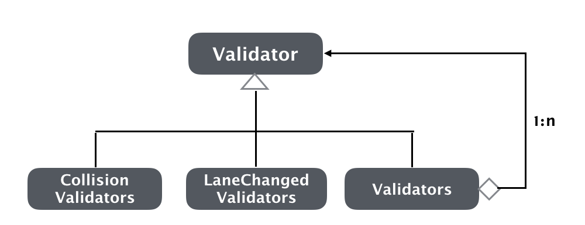

### 演进模型

我们又得到了新的需求：

- 用户可以断言发生过变道，也可以断言没发生过变道
- 同理用户可以断言出现过碰撞，也可以断言没发生过变道

对于这两个需求的实现，直接的做法是修改每个具体的Validator类，将客户的期望存下来。每次返回bool值得时候根据客户期望做判断后返回。例如：

~~~cpp
struct CollisionValidator : Validator
{
    CollisionValidator(bool expectExist) : expectExist(expectExist)
    {
    }
    
private:    
    void onEvent(const VehicleInfoEvent&) override;
    bool hasOccured() const override
    {
        return expectExist == hasCollision;
    }

private:
    bool hasCollision{false};
    bool expectExist;

};
~~~

对于LaneChangedValidator，我们发现修改基本一致。这里消除重复代码，可以把重复的逻辑提到父类Validator中去。但是不要忽视重复代码，往往它们的出现相当于一个信号，告诉我们有领域概念需要被发掘。

经过分析会发现，用户对任何一个断言事件，都可以描述为“期望发生XXX”和“不期望发生XXX”。而事件是否发生则和用户的期望无关，之和我们收到的消息状态相关。我们可以认为是否发生碰撞以及变道，是一个**事实**，而客户描述的“期望存在”或者“期望不存在”则只是一种**期望**，最后事实和期望一致说明断言成功，否则说明断言失败。

经过上述分析，我们修改模型如下：

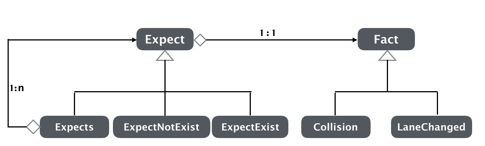

可见我们对Validator中表示用户希望和表示事实情况的部分拆开了。这样Fact部分就只管判断某种具体的事实有没有发生，而Expect部分只关注用户的期望是什么，两部分组合起来是一个完整的断言判断。

~~~cpp
struct Expect
{
    virtual bool evaluate(const VehicleInfoEvent&) = 0;
    virtual ~Expect(){}
}

struct Expcects : Expect
{
    void addExpect(Expect&);

private:
    bool evaluate(const VehicleInfoEvent& event) override
    {
        // verify every expect in expects
    }

private:
    std::list<Expect*> expects;
};

struct ConcreteExpect
{
    Expect(Fact& fact) : fact(fact)
    {
    }
private:
    virtual bool evaluate(const VehicleInfoEvent& event)
    {
        fact->onEvent(event);
        return doEvaluate(fact->hasOccured());
    }

private:
    virtual bool doEvaluate(bool hasOccured) const = 0;

private:
    Fact& fact;
};

struct ExpectExist : ConcreteExpect
{
    using Expect::Expect;
private:
    bool doEvaluate(bool hasOccured) const override
    {
        return hasOccured;
    }
};

struct ExpectNotExist : ConcreteExpect
{
    using Expect::Expect;
private:
    bool doEvaluate(bool hasOccured) const override
    {
        return !hasOccured;
    }
};

struct Fact
{
    virtual void onEvent(const VehicleInfoEvent&) = 0;
    bool hasOccurred() const
    {
        return occured;
    }
    virtual ~Fact(){}
    
private:
    bool occured{false};
};

struct Collision : Fact
{
private:
    void onEvent(const VehicleInfoEvent& event) override
    {
        // verify if collision occured by event
    }
};

struct LaneChanged : Fact
{
private:
    void onEvent(const VehicleInfoEvent& event) override
    {
        // verify if lane change occured by event
    }
}
~~~

以上是部分代码。可以看到我们现在有两套继承体系，一套是Expect和Fact。Fact不会关心客户是怎么期望的，只根据消息判断某一具体事实是否发生。而Expect不会关心Fact如何进行消息处理，只关心客户是如何期望的。对于任一个断言我们分别从两套素材库里面取具体的素材进行拼装组合。

例如用户描述“希望没有发生碰撞”但同时“希望发生了变道”，组合的代码大概如下：

~~~cpp
auto collision = new Collision();
auto laneChanged = new LaneChanged();
auto notExist = new ExpectNotExist(*collision);
auto exist = new ExpectExist(*laneChanged);
auto expects = new Expects();
expects->addExpect(*notexist)
expects->addExpect(*exist)

// feed events to expects->evalute(event)
~~~

上面的代码只是示例，我们目前没有关注内存管理的问题。前面的代码中，我们在Expect中存的是Fact的引用，在Expects中存的是Expect的指针。C\++为了追求效率，把内存管理的责任留给了程序员。但我们不应该过早地把内存如何管理耦合进领域模型中。很多C\++程序员喜欢在这里使用智能指针。但是一旦使用了智能指针，就得一直使用下去，一方面大面积污染代码，另一方面使得领域对象和具体的内存管理方式耦合在了一起。领域对象尽量只关注依赖谁，而不去关心应该保存对方的shared_ptr、unique_ptr。这些问题我们尽量最后把它们留给领域层之外的其它层（例如基础设施层）去解决。

另外通过上面示例的组合代码，我们随着代码职责的分离，代码元素会变多，导致组合过程却变复杂了。其实更准确的说，不是复杂而是繁琐。因为组合的代码一般并不难理解，只是步骤变得琐碎了而已，但是只要代码元素是易组合的，深刻地反映了领域本质，那么组合过程一般都是有规律的。对于组合拼装，面向对象一般会交给专门的Factory或者Builder去做，支持反射的语言会交给框架来帮忙做。而对于我们这个例子，我们把这件事最后留给DSL来做，而往往DSL就出现在描述领域模型繁琐但是有规律的组合过程中。

### 再演进模型

我们得到新的需求：

- 可以断言车辆是否停止
- 可以断言车辆停止后，车所在的车道ID等于某个值

第一条需求很容易实现，再增加一种Fact，根据收到消息里的车速来判断车辆是否停止。然而对于第二条，玩具车所在的车道ID在每条消息里面都有携带，所以我们可以增加一种Fact，专门用于判断车的实时车道ID是否和预期值相同，但是这条断言要求我们的判断条件是要等到车辆停止后。

在这里我们发现一个有意思的变化，那就是断言是有前置条件的。那么另一个问题来了，在前置条件没有发生的时候，断言的状态应该是什么？

首先我们来解决断言的前置条件的问题。简单地可以给Expect类增加一个表示前置条件的属性，默认为空。如果有前置条件，那么先判断前置条件满足，然后再进行自身期望的判断。但是这个设计会引出一串的问题：

- 前置条件如果还有前置条件怎么办？
- 前置条件的判断会比较复杂，例如用户可以描述“期望某事发生“的条件下或者“期望某事不发生”的条件下；

通过分析，实际上我们可以发现，前置条件的本质也是对某一事实的期望，当期望被满足的时候再进行下面的一项期望判断。而且前置条件还可能再有前置条件。所以我们必须找到一种简单的模型来表示它。

现在我们回过头来看看前面的Expects的设计，它存储了一组Expect，这组期望之间是并行的关系，也就是说Expects收到的每一条消息需要转发给它保存的每一个Expect，然后评估每个Expect的结果。

现在为了应对前置条件，事实上我们需要对Expect进行新的一种组合，这种新的组合将按照用户的期望顺序进行编排，当前一个满足了，才能进行后一个的评估。这样就解决了前面的问题，前置条件同样是一个Expect，前置条件的前置条件只是排在更前面的一个Expect而已。

那么下来还需要解决的一个问题就是在前置条件没有发生前，Expect是什么状态？之前Expect的结果是bool值，只有true和false两种值。现在如果一个Expect还没有被轮到评估，那么它还应该有第三种值，我们叫做`unknown`。

现在是时候调整模型了。每个Expect可以被想象成对未来的一个期望，它们在时间上可以串成并行的或者串行的。并行的表示同时进行评估，串行的表示前面的评估成功了才会轮到后面的。于是我们将Expect重命名成`Promise`，同样是表示期望的一个单词，但是Promise更有意思点。Promise在并发编程里往往表示对未来结果的一个句柄，你可以持有它，可以对他求值，但是在期望的未来事件没有发生前，它的状态是未知的。我们在这里借鉴了这个概念。

调整后的模型如下：

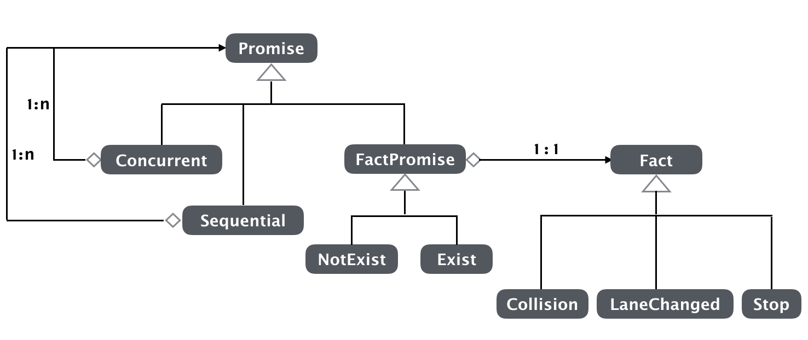

我们把Expect重命名为Promise。将原来的Expects重命名为更合适的Concurrent，表示时间线上并行的期望。新增加了Sequential，用于表示时间线上串行的一组期望。而原来的NoExist和Exist则继承自名为FactPromise的基类。FactPromise可以组合进一个Fact，它实现了一个状态机，用来决定在何时返回`unknown`或者`success`,`failed`。

到现在为止，我不准备再贴代码了。代码在github上可以找到：[https://github.com/MagicBowen/muse](https://github.com/MagicBowen/muse)。接下来我们通过模型来交流，先从概念层面上看看Promise。

首先可以认为Promise是对未来的一种期望，它保存了一个对未来的断言结果。

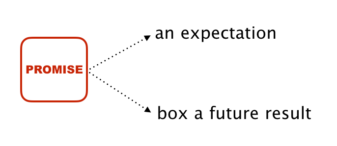

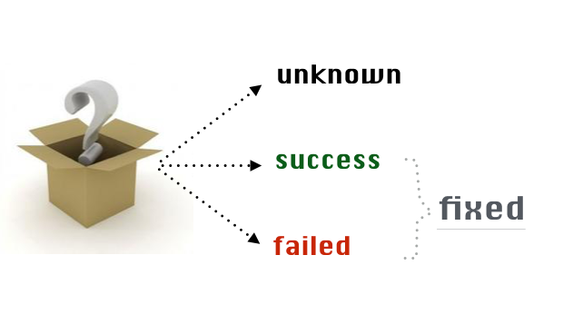

基本的Promise（FactPromise）可以组合一个Fact，例如当一个Fact和Exist或者NotExist组合后，就变成一个具体的用户期望了。如下图：

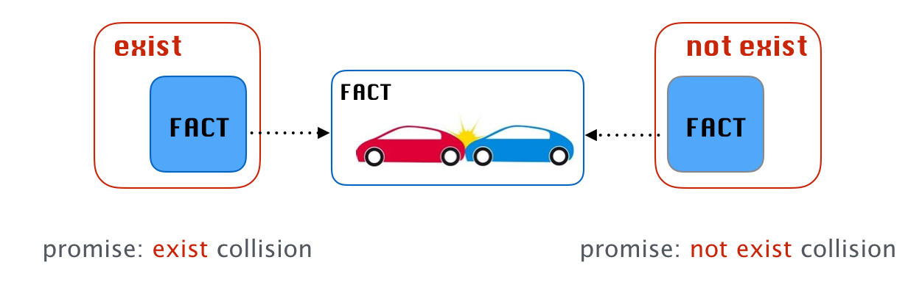

Concurrent可以组合一组Promise，它们表示一批并行的期望关系。

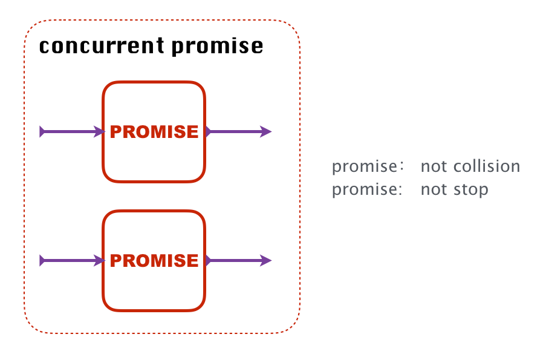

Sequential也可以组合一批Promise，它们表示的是时间线上串行的一组期望关系。

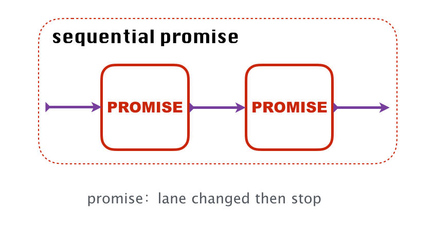

对Concurrent和Sequential的实现使用了组合模式，正因如此，它们可以继续组合。

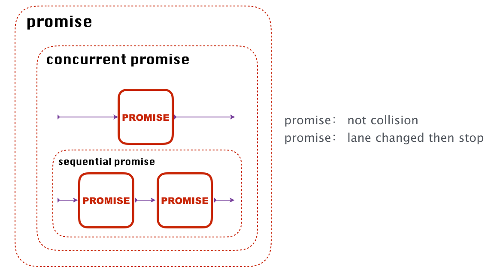

借助于Promise的这种可组合特性，我们容易的实现了用户下面的需求。

- 期望玩具车没有发生碰撞，直到车变道为止。

可以认为是一种特殊的Concurrent，两个Promise被并发的执行，一个决定了另一个何时被停止。我们给其起一个好听的名字，叫做UtilPromise。其中一个表示until条件的promise一直用来判断结束条件，另一个做真正的断言。当until满足的时候，停止另一个promise的运行。

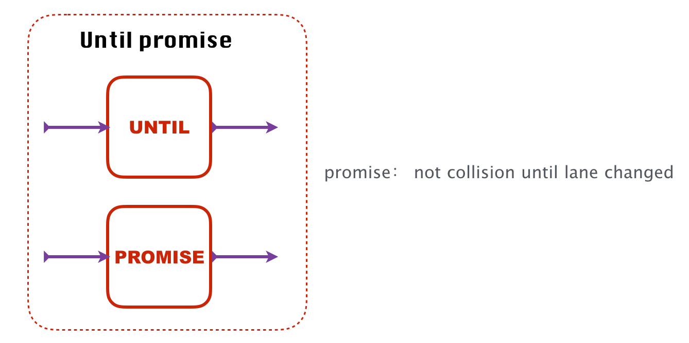

事实上，Promise的这种组合能力源自它的**闭包性**。正是由于闭包性，使得Promise的可以按照任意粒度去组合。Promise在组合过程中形成了一种有向无环图（DAG），在模型上类似于依赖网络。用户可以按照他们对期望的时间线编排来描述Promise之间的关系。

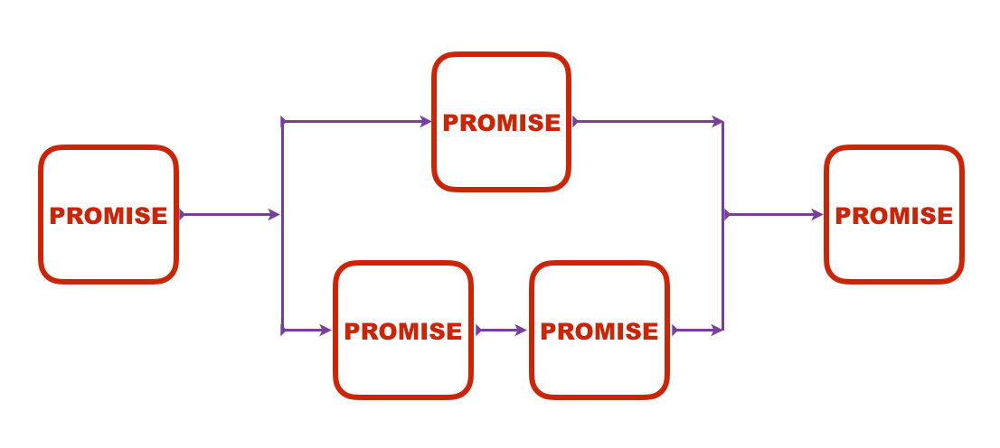

组合模式和修饰模式是实现闭包性极其合适的工具，而组合模式和修饰模式合起来则是一种很重要的设计模式 - **解释器模式**，所以满足闭包性则很容易在代码上为其建立起一套DSL。

现在还是让我们先回到Fact的概念上。

我们之前说了Fact表示一种客观事实，和用户的期望无关。每种Fact只关心一种具体的事实，它不断地接收消息，判断对应的事实是否发生。所以Fact只有两种状态：`occured`或`not occured`。

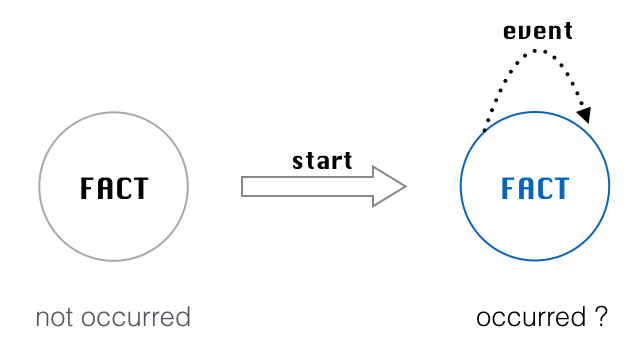

目前已经有的Fact，如Collision，LaneChanged，Stop等，都比较简单。它们都仅仅是根据消息不断检测某种事件是否发生。现在我们面临一条新的需求，要求可以判断车所在车道ID是否等于预期的ID。

玩具汽车实时上报的消息里面包含当前所在的车道ID，所以我们可以再增加一种Fact，接收消息里的车道ID，然后和客户的期望值进行相等判断。

过了几天用户又提了需求，希望可以断言车辆没有经过某个车道ID。这时我们还可以再增加一种Fact，只是判断逻辑变成不等于用户提供的车道ID。

随后我们又遇到新的需求，客户期望可以断言车和前方最近物体的距离等于、大于、小于或者在某个范围内。玩具汽车通过传感器可以获取它和前方最近物体的距离，并在状态消息里实时上报，所以写个Fact获取对应的数字并不难，但是判断的比较逻辑却有好几种：等于、大于、小于以及在某个范围(min, max)内。

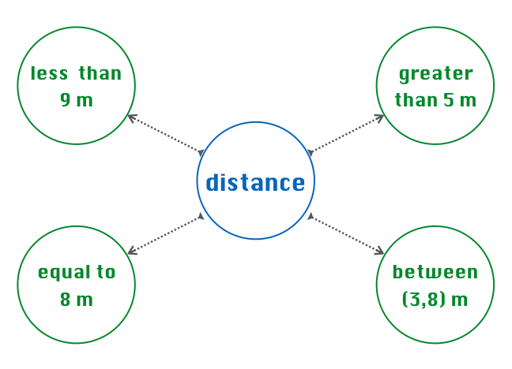

到现在为止我们发现不能再像之前那样为距离的每种比较方式都写一个Fact类，否则可以产生数量的Fact和数量的判断方式之间组合起来，我们得要写M*N种Fact。我们希望把用户断言中的Fact和Fact中对量进行比较的方式分离开来，这样我们就提供M+N中元素，然后根据断言自由去组合。量的比较方式是领域模型的一部分，它的入参是一种量，返回一个bool值，我们习惯对将其命名为`Predicate`，如此一来，Fact的模型重构如下：

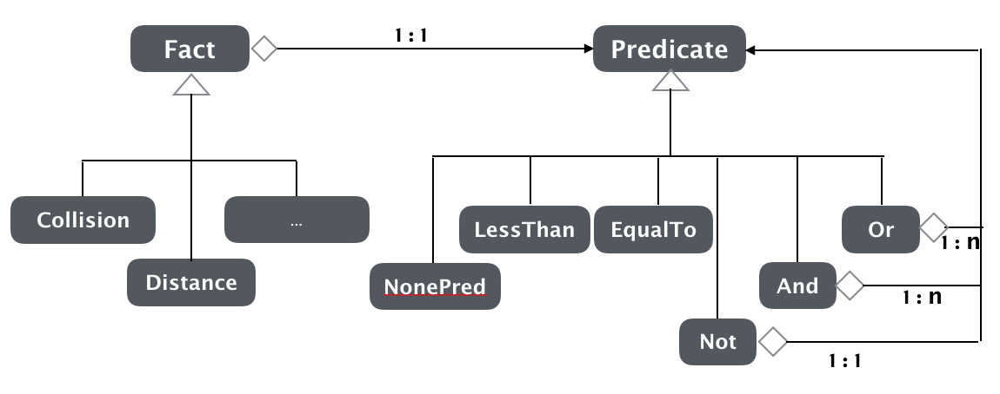

如上，一个Fact需要和Predicate组合在一起。Fact中默认组合进NonePred，这样兼容原来Collision这种简单的Fact。如果是可以产生量的Fact，例如Distance，则需要根据用户的断言描述，组合合适的Predicate子类对象。

对于Predicate，我们提供了LessThan和Equal以及逻辑运算符Not，基于这三者可以组合出其它所有的比较运算（>, >=, <=）。同时提供了逻辑运算符And和Or，这样用户可以组合出例如Between这样的复杂比较运算。

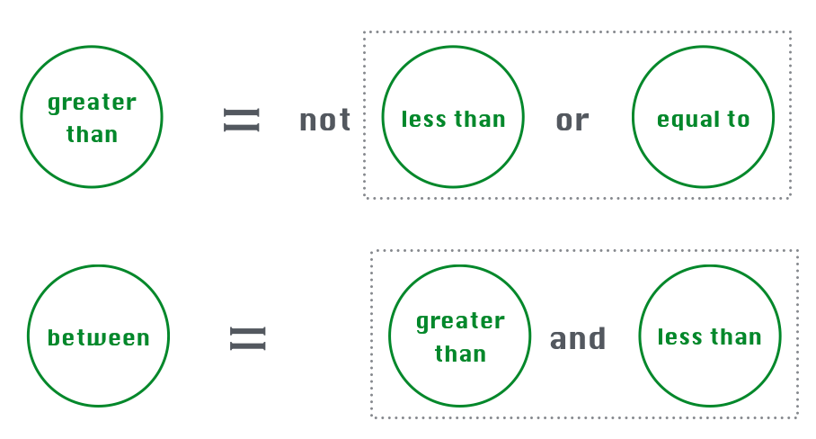

由于Predicate也是满足闭包性的，所以我们对Predicate 无论进行多么复杂的组合后，它在逻辑上仍然是一个Predicate，可以直接被组合进Fact。由于Predicate对比较数量的类型信息是未知的，所以实现上使用了一些模板技术，具体请参考代码实现。

有了上面的抽象后，用户提出的如下新的需求就很容易实现了：

- 可以断言车辆中心点和车道线中心点的偏移量（lane gap）是否大于某个给定值min_lane_gap
- 可以断言车辆中心点和车道线中心点的偏移量（lane gap）是否小于某个给定值max_lane_gap
- 可以断言车辆中心点和车道线中心点的偏移量（lane gap）是否在某个给定范围内(min, max)

我们只用新增加一种新的Fact，从消息中拿到lane gap的值，然后根据用户的断言描述组合进合适的Predicate就OK了。

最后用户希望可以在断言中指定对distance或lane gap实时计算**平均值**或者**方差值**，判断其结果是否大于或者小于某个给定值，或者是否在某个给定范围内。

通过这个需求，我们发现除了要能对某个Fact中获得的原始数量值进行比较运算断言，还要能够对该值进行某种指定的算法运算，然后再对结果进行比较运算断言。

为了实现这个需求，我们引入一个新的概念`Algorithm`，它接收Fact传入的值，按照算法要求对值做计算，它不关心最后的结果要被如何比较。然后我们实现了一种Predicate的新子类ComposePredicate，它可以将Algorithm和Predicate组合在一起，它把入参先交给Algorithm进行计算，然后再把结果交给组合进的Predicate进行比较运算。由于它逻辑上仍然是一个Predicate，所以可以被直接组合进Fact。

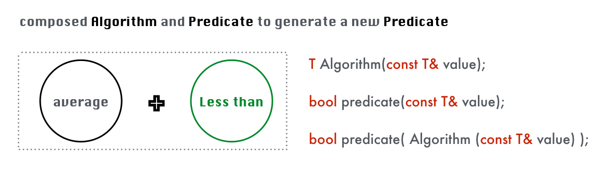

Compose在模型中的位置如下。注意下图只是一个示意图，Algorithm由于计算的数据类型不确定，所以并没有统一的抽象类接口。Compose实现时使用了模板参数进行组合的。具体参见源码。

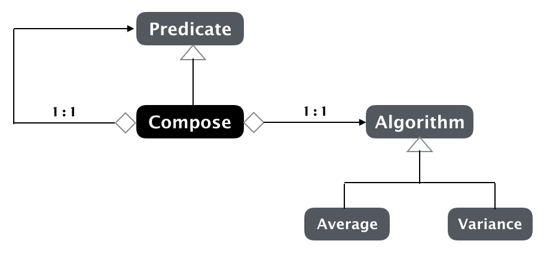

到现在为止，模型全景图如下：

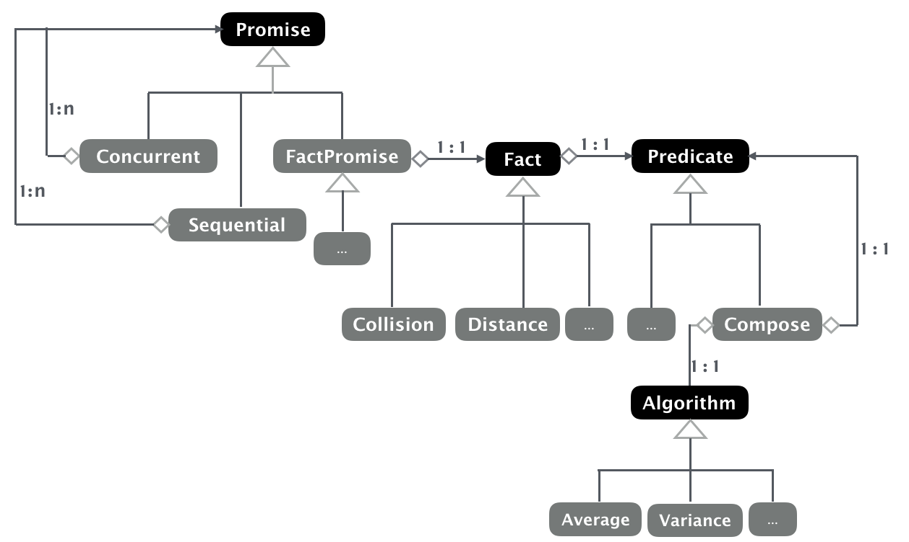

在整个设计过程中，我们采用组合式设计的方式，不断分离变化方向，对新的元素在领域中寻找贴合的命名，最后得到如上的模型。其中核心领域概念只有四个：Promise，Fact，Predicate和Algorithm。每种概念表示一种明确的领域知识，它们通过组合构成一项断言。其中Promise和Predicate满足闭包性，可以通过自组合完成更复杂的功能。正是由于这种可组合性，使得我们的代码虽然简单但又十分地灵活和强大。

### 提炼模型

领域驱动设计倡议通过划分BC(Bound Context)突出Core Domain，BC内再通过分层再将领域层与其它层分离开来以突出领域模型。

到目前我们发现，基于Promise的这套断言模型不仅可以用来对玩具车的行驶状态进行断言。事实上任何按照顺序产生事件流的系统，都可以用这套断言系统对关键事件及其关系进行断言，所以我们把断言系统的core domain划分出来，以便可以在更大范围内复用。

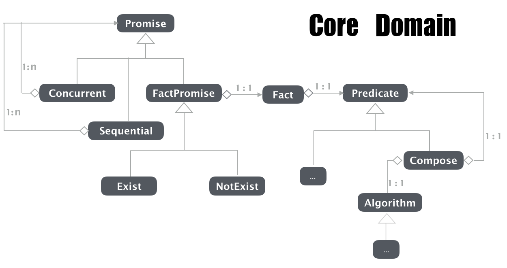

如上core domain中Fact只包含最顶层的抽象类，不包含它的任何子类。Core Domain的使用者只要继承Fact，实现自己的具体Fact，然后组合正确的Promise，按照断言的时间顺序编排Promise（Concurrent，Sequential或Until等），就可以在自己的领域使用这套断言模型了。

由于是使用者的具体Fact继承自抽象Fact，所以core domain并不依赖任何的使用者。但是遗憾的是目前的实现中，所有的Promise和Fact抽象类接收的消息都硬编码依赖了` VehicleInfoEvent`类型。实时上我们发现任何的Promise类，以及Fact虚基类都只是透传VehicleInfoEvent消息，消息到了具体的Fact子类才会处理其内部细节。所以理论上我们的Core Domain只用依赖一个消息句柄即可，具体的消息由使用者传入Core Domain，最后再在具体的Fact子类中去处理，我们的Core Domain应该对客户的消息细节一无所知。所以我们重构代码，首先实现一个空的虚基类`Event`作为消息句柄。

~~~cpp
struct Event
{
    virtual ~Event(){}
};
~~~

然后修改所有Promise以及Fact虚基类，把它们处理外部消息的接口参数类型从具体的`const VehicleInfoEvent&`改为`const Event&`。

~~~cpp
struct Promise
{
    virtual bool evaluate(const Event& event) = 0;
    // ...
};

// all subclass of Promise should be modified.

struct Fact
{
    virtual void onEvent(const Event& event) = 0;
    // ...
};
~~~

接下来，需要客户的具体消息继承自Event，这样就可以把它传递给Core Domain了。Core domain持有具体消息的Event*指针，将其再透传给客户具体的Fact进行处理。客户的Fact接收到Event*后需要使用dynamic_cast将其转成自己的具体消息类型。由于消息是客户代码交给core Domain，然后再从core domain中拿出来的，所以客户理应知道消息的具体类型，而core domain只持有消息的句柄，对消息以及要处理消息的最终Fact一无所知。这样core domain就变成了一个通用框架（这种框架代码持有句柄，由客户代码决定具体类型的做法，是框架代码的一种惯用法，为此boost::any类就是专门封装做此事的，本质上都是使用dynamic_cast做转换）。

如上图，虽然Client Domain和Core Domain是同步接口调用关系，但是我们通过抽象实现了依赖隔离。Core Domain使用Event和Fact的抽象，而Client Domain实现抽象，最终两者都依赖于更稳定的抽象。

最后我们来看看内存管理。在core domain内部，无论是Promise还是Fact都使用了动态多态，所以需要使用指针。对于指针指向对象的内存如何管理是C\++绕不开的设计。不过我们建议最好不要在domain层过早假设客户的内存使用方式。领域对象最好只声明自己依赖谁而不耦合对方的内存管理方式，所以建议是不要过早地使用智能指针。我们在实现core domain时，对依赖的抽象类型使用的尽量是引用或者裸指针，我们把内存管理尽量推迟到外部组合它们的时候由客户代码决策。而至于客户代码是要重载new还是使用专门的allocator，是使用静态内存、动态内存抑或堆栈内存，是使用unique_ptr还是shared_ptr，都由客户根据自己的使用场景来决策，领域层代码对此是无感知的。

通过下一节我们将会看到，我们构造的两种DSL对领域对象使用了不同的内存管理方式，而领域层代码对此完全不关心。

## DSL

当你能够良好地使用组合式设计，最后总会得到分类好的代码元素，它们需要以某种设计好的模式进行组合才能进行工作。一般情况下，对这种组合工作应用一些Factory或者Builder模式，提供良好的API就足够了。但是某些场景下，我们需要设计一种领域专用语言，来提供更好的描述方式。Martin Fowler在DSL一书中总结道，DSL只是领域模型表面的一层封装而已，核心还是领域模型。所以一开始我们就一直把重点放在领域模型的演进上。虽然说领域模型是核心，但并不保证有了领域模型就一定可以设计好DSL。一方面可能由于领域元素的组合模式并不明显导致难以规律化，另一方面DSL设计确实也需要一些专门的技术。

对于前面我们设计的断言系统，我们最终需要提供给用户一套DSL，让用户使用DSL来描述断言，而我们根据用户描述的断言内容来选择合适的模型元素进行组合，以完成每条断言对应的功能。

### 内部DSL

为了方便对模型进行独立测试，我们首先构建了一套内部DSL。在我们的设计中，一条用户断言可能需要选择不同的Promise、Fact、Predicate和Algorithm的元素进行组合，事实上这些元素如何组合通过模型早已确定下来了（见前面的类图），DSL只是对这一确定的组合模式选择一种描述方式而已。

内部DSL的构建方式Martin Fowler进行了详尽的总结：连贯接口、函数嵌套、方法级联、闭包、宏...，C++语言支持所有这些方式。由于我们的内部DSL用于对模型进行自测，所以一个用户断言定义在一个测试方法内，离开这个测试方法，断言也就无用了。在这种情况下，所有组成断言的元素直接生成在测试函数的栈内存上是最方便的。

~~~cpp
auto promise = __con(__not_exist(Collision),
                     __seq( __exist(__fact(Stop))
                          , __exist(__fact(Distance).predOf(LessThan<double>(5)))));
~~~

如上所示，它的含义如下：

- 测试中不希望出现碰撞
- 期望车停下来，然后它和前方物体的距离小于5m

上述DSL描述的组装方式和下面的代码是一致的：

~~~cpp
Collision collision;
NotExist promise1(collision);

Stop stop;
Exist promise2(Stop);

LessThan<double> less(5);
Distance distance;
distance.addPred(less);
Exist promise3(distance);

Sequential seq;
seq.addPromise(promise2);
seq.addPromise(promise3);

Concurrent con;
con.addPromise(promise1);
con.addPromise(seq);
~~~

首先我们的每个元素使用的是函数栈上的临时内存，得益于我们领域层分离了对内存管理方式的假设，领域对象无需关系是否需要自己delete内存。其次我们看到，使用DSL来描述组合关系更加的紧凑和连贯，对象的组合关系天生的和一颗构造树映射，而非DSL的构造代码则显得有些碎片化。

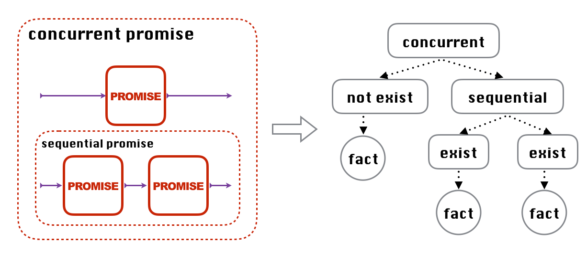

在这套内部DSL我们使用的是函数级联，所以做到了让对象的内存直接产生于函数栈上。另外使用了一些模板来帮忙做类型推断，感兴趣的话可以直接看代码。

### 外部DSL

外部DSL是我们真正提供给外部用户描述断言的接口。对于如何实现外部DSL，我们有更多选择性，例如我们可以选择让用户使用XML或者JSON之类的文本标记语言来描述。很容易把上面例子中的断言用一段XML或者JSON描述出来，因为XML或者JSON天生的树状结构很适合用来做这事，但是我们会发现这种借助已有标记语言的描述里面有太多不友好的语法噪音。

如果往另一个方向走，我们期望用户能够以一种类似自然语言的方式进行描述。但要警惕这条路不能走的太过头，因为自然语言是不严谨的，放任用户的描述方式，只会让自己陷入来回补洞的尴尬境地。

对于本例我们希望创造一种尽量减少噪音的形式化语法，专门用来表述断言。然后针对这门语法我们写一个小小的解释器，将用户的描述翻译到C\++领域模型的组装上去。

以下是使用我们创造的外部DSL描述的一条断言：

如上，第一行我们声明了一个Fact，我们给它起名`in target lane`，它的含义是“车在第2车道上”。第二行我们声明了一个断言，这里使用的是`promise`关键字，断言里面借用了一些形象的符号来表示promise之间的关系， `&&`表示concurrent， `->`表示sequential， `-|`表示until。断言里面对于简单的Fact可以直接使用，例如Collision，Stop，还可以引入前面已经声明的具名fact（例如 in_target_lane）。如果在fact的名字前加`!`则表示期望`NotExist`，否则表示`Exist`。

了解了规则，那么下面这条断言什么意思，能直接看出来吗？

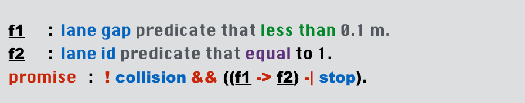

对于外部DSL的实现我们使用了[antlr4](https://github.com/antlr/antlr4)。Antlr是一个开源语法分析器，借助它可以轻松地为你自己设计的语言开发语法解释器。使用antlr提供的规则描述你的语法，antlr会根据需求自动为你生成语法分析器的目标语言代码。

如下是我们使用antlr描述的外部DSL的语法的主要部分，稍微熟悉编译原理的同学应该不难理解这段描述。

~~~
factdef  :   ID ':' fact END;

fact     :   sfact
         |   pfact
         ;

sfact    : 'collision'                    # collisionFact
         | 'stop'                         # stopFact
         ;

pfact    : pfname 'predicate that' algo? pred ;

promisedef  : 'promise' ':' promise END;

promise  :   promise '&&' promise         # concurrent
         |   promise '||' promise         # optional
         |   promise '->' promise         # sequential
         |   promise '-|' promise         # until
         |   '!' basepromise              # notExist
         |   basepromise                  # exist
         |   '(' promise ')'              # parens
~~~

为了让语法错误的检查更加靠前，

## 总结
