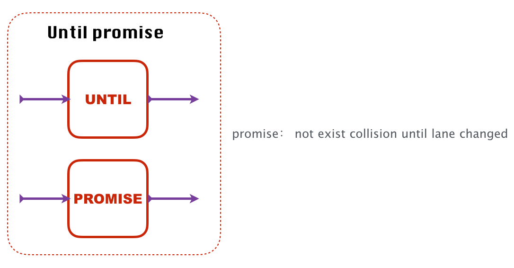
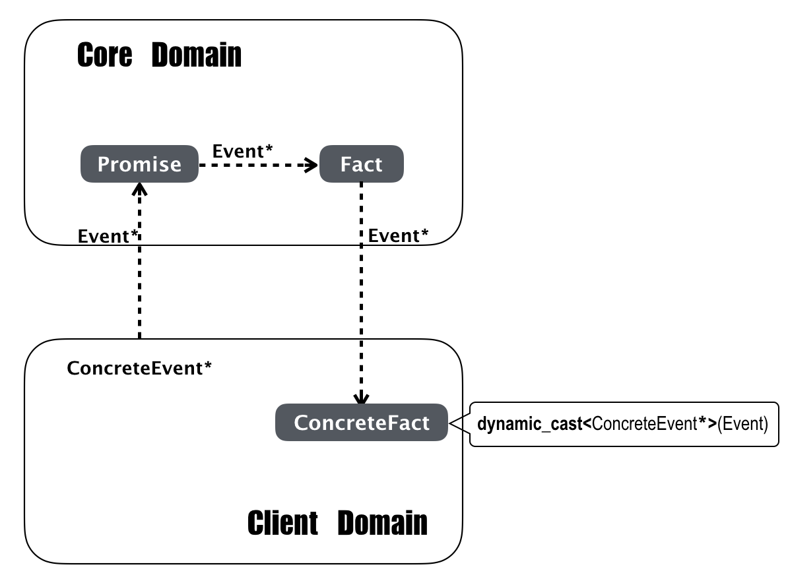

# muse：promise based assertion framework

领域驱动设计（DDD）旨在软件设计过程中提炼领域模型，以领域模型为核心改善业务专家和软件开发者的沟通方式，对企业级软件开发起到了巨大的推动作用。遗憾的是市面上关于领域驱动设计的书和例子使用的都是偏向应用侧的编程语言，如java、python等。下面以一个改编简化过的真实案例，和大家讨论一下如何使用C\++语言进行DDD设计。

## 问题

假设有一个智能电子玩具生产商，他们最新一代电动智能玩具汽车具有如下一些新功能：

- 可以通过遥控器设定玩具汽车沿着游戏场地的某条车道线行驶
- 玩具汽车可以根据遥控器的控制进行车道变换
- 玩具汽车在行驶过程中如果发现前方有静止物体阻挡则会自动停车
- 玩具汽车在行驶过程中如果发现前方有同方向低速移动物体则会自动跟随

生产商已经有一套半自动测试环境用来对玩具汽车做测试。测试人员可以在电脑主机上提前编辑好对玩具汽车的遥控指令，然后通过无线网络对实验场地上的玩具汽车进行指令下发。玩具汽车在行驶过程中会每隔100ms将车上所有传感器的实时信息通过无线网络上报给服务器，内容包含当前的车速、所在车道ID、和车道中心线的偏移距离、和正前方最近物体的间距、以及是否发生了碰撞等等。测试人员通过观察玩具汽车的行驶状态以及分析收集上来的消息log，人工判断每次测试中车辆的行驶是否符合预期。

现在生产商想要开发一套断言系统，用来替代原来的人工结果分析。生产商希望有了这套系统后，测试人员只用通过测试用例描述车辆在每个测试用例中期望的关键行驶行为。自动化测试系统负责执行测试用例，在测试过程中不断接受玩具汽车上报的状态信息，然后交给断言系统实时判断车辆行驶行为是否和断言描述一致。

如上图所示，这套断言系统将被集成进原有的测试系统，最终运行在同一台server上。至于如何遥控汽车和接收汽车的状态信息，不是断言系统的关注点。现在我们选择使用C\++语言来实现这套断言系统，一方面是为了更容易与原来的C\++系统进行集成，另外也是考虑到了计算的实时性和性能等原因。但无论如何现在开始我们把关注点放到对断言系统的设计和实现上。

## 领域建模

### 面向对象

实现系统得先要定义系统的边界。断言系统的边界如下：

1. 系统需要提供一套DSL（领域专有语言），供玩具车测试人员来描述断言。
2. 系统会不断接收车辆状态消息。
3. 系统会接收车辆状态消息，实时进行断言判断，最终输出断言结果：成功或者失败。

虽然提供用来描述断言的DSL非常关键，但是[Martin Fowler](https://martinfowler.com/)在《[Domain-Specific Languages](https://martinfowler.com/books/dsl.html)》一书中明确说了，DSL只是对领域模型的一层封装而已，应该先有领域模型然后有DSL。所以这里我们先不着急设计DSL，我们先把核心放到领域建模上。

领域驱动开发强调使用领域模型来反映对领域本质的理解。针对要解决的问题，对领域进行抽象，提炼出核心领域概念和关系，最终围绕这组抽象去简单自洽地解决问题。

因此我们从问题出发，先看优先级最高的两个需求。我们采用演进式设计，随着增加需求迭代地演进模型。

- 可以断言车辆在测试过程中没有发生过碰撞
- 可以断言车辆没有发生过变道

对于上面两个需求，熟悉面向对象设计的同学能立即想到的一个设计就是实现一个`Vehicle`类，用来在软件中映射现实世界中的玩具汽车。Vehicle的对象可以一直接收车辆状态消息并存储断言关注的信息，随后提供接口供断言判断。

玩具汽车每隔100ms上报的状态消息内容是已知的（如下），Vehicle类需要有一个处理该消息的接口。

~~~cpp
struct VehicleInfoEvent
{
    int id;              // 玩具汽车的唯一编号
    bool collision;      // 是否碰撞
    int  laneId;         // 当前所在的车道ID
    double speed;        // 当前车速（m/s）
    double laneGap;      // 和车道中心线的偏移距离（m）
    double distance;     // 和前方最近物体的距离（m）
    // ...
};
~~~

为了实现第一个需求，Vehicle只要把消息中车辆是否碰撞的信息存下来即可。实现第二个需求，Vehicle需要记录住车辆所在的车道ID，然后每次收到消息后判断该ID是否发生过变化。最后Vehicle提供两个用于判断的接口，用来供客户代码查询对应的断言结果。

~~~cpp
struct Vehicle
{
    void processEvent(const VehicleInfoEvent&);
    bool hasCollisionOccurred() const;
    bool hasLaneChanged() const;

private:
    bool collisionOccurred{false};
    bool laneChanged{false};
    int currentLaneId{INVALID_ID};
};

~~~

测试系统每收到一条玩具汽车上报的状态消息，就调用Vehicle的`processEvent`接口去处理，然后再调用`hasCollisionOccurred`或者`hasLaneChanged`，看车辆是否发生了撞击或者变道。

上述设计已经简单有效地解决了问题。面向对象告诉过我们有了对象就能容易地映射现实事物，对问题域进行建模，看上去确实如此！

可是当我们观察Vehicle类，至少发现它有如下一些问题：

- Vehicle里的接口和属性是分属于两个不同的断言的，现在却耦合在一个类里面。假如用户只断言了“没有发生过碰撞”，事实上Vehicle却要负责携带和“是否变道”相关的接口和属性。
- 断言之间是互相独立的，但是目前对任何一个断言的修改，都得在Vehicle一个类内进行。
- 随着断言的增加，Vehicle势必变成上帝类。

> 虽然面向对象可以很容易地对现实进行建模，可绝不是刻板地映射现实。实践告诉我们对现实进行刻板地、缺乏抽象的建模往往只能得到脆弱和缺乏弹性的模型。优秀的设计实践告诉我们需要分离变化方向，让每个变化方向上的修改独立可控。这就是为什么设计模式中会出现Strategy，Oberver，Decorator这些和现实领域无关的词。而领域驱动设计则告诉我们要把这些为了更好应对变化的代码元素进行区分，把能够反映领域知识的拿到领域模型中来，给它们好的名字，让它们变成软件对领域深入理解的表达。

分析上面的Vehicle类会发现它的最大问题就在于把面向不同断言的接口和数据耦合在了一起。为此，我们需要将其进行拆分，将属于不同断言的数据和接口分离开到不同的类中，这样代码后续对某个断言的修改就不会影响到其它断言。因此我们的领域模型需要有新的概念，这里我们起名`Validator`。

~~~cpp
struct Validator
{
    virtual void onEvent(const VehicleInfoEvent&) = 0;
    virtual bool hasOccurred() const = 0;
    virtual ~Validator(){}
};
~~~

不同的断言对应不同的具体Validator。

~~~cpp
struct Collision : Validator
{
private:
    void onEvent(const VehicleInfoEvent&) override;
    bool hasOccurred() const override;

private:
    bool occurred{false};
};
~~~

~~~cpp
struct LaneChanged : Validator
{
private:
    void onEvent(const VehicleInfoEvent&) override;
    bool hasOccurred() const override;

private:
    int currentLaneId;
    bool occurred{false};
};
~~~

现在，我们可以为不同的断言创建不同的Validator子类对象。由于对Validator的修改是互相独立的，我们的系统做到了开放封闭。对于一个断言系统来说，它的领域概念中存在“validator”是十分合理的。

最后我们再定义一个Validator的集合，将客户一个测试用例中的多条断言存放在一起。为了保持领域模型接口的一致性，可以把Validator的集合也看成是一种Validator，它接收车辆状态事件，将其转发给内部的每一个具体validator。它也提供一个`hasOccurred`接口，当内部所有断言都成功时返回真，否则返回假。

~~~cpp
struct Validators : Validator
{
    void addValidator(Validator&);
    
private:    
    void onEvent(const VehicleInfoEvent&) override;
    bool hasOccurred() const override;
    
private:
    std::list<Validator*> validators;
};
~~~

如上对于Validators我们使用了组合模式，它负责把用户描述的多个断言组织在一起，对外仍然呈现Validator的接口。到现在所有的概念又得到了统一。我们通过新的模型简单自洽地解决了问题。到现在`Vehicle`类已经没有剩下什么东西了，可以删除掉它。现在我们得到了一个更深刻的模型。

### 挖掘领域

我们又得到了新的需求：

- 用户可以断言发生过变道，也可以断言没发生过变道
- 同理用户可以断言出现过碰撞，也可以断言没发生过变道

对这两个需求的实现，最直接的做法是修改两个具体的Validator类，将断言中描述的是否期望的flag存下来。每次返回bool值的时候根据该flag先做判断再返回结果。例如：

~~~cpp
struct Collision : Validator
{
    CollisionValidator(bool expectExist) : expectExist(expectExist)
    {
    }
    
private:    
    void onEvent(const VehicleInfoEvent&) override;
    bool hasOccurred() const override
    {
        return expectExist == occurred;
    }

private:
    bool occurred{false};
    bool expectExist;

};
~~~

对于LaneChanged，修改基本一致。

修改结束后会发现Collision和LaneChanged中出现了重复代码。可以简单地实施重构手法，将它们中重复的逻辑上移到公共父类中去。然而站在领域驱动开发的过程中看，重复代码往往是一个信号，告诉你可能存在重要的领域概念没有被发掘出来。**不要忽视重复代码**！

经过分析会发现断言系统主要关注车辆行驶过程中的关键事件（例如碰撞、变道等）。关键事件是否发生是从车辆上报的状态消息中进行计算得到的，是一个**事实**，不以人的主观期望而改变。而断言的撰写者对任何一个关键事件进行描述，则可能会加上“期望XX发生”，或者“期望XX不发生”。这里的**期望**则是一种主观愿望，最后事实和期望一致说明断言成功，否则说明断言失败。

于是我们得到了如下结论：**一个断言由一个期望加事实组成**。

现在让我们把对领域的最新认识反映到模型上来。

我们把原来Validator中表示用户期望和表示事实情况的两部分拆分开来。其中`Fact`表示事实，它只管根据收到的消息判断某种特定的事件有没有发生。`Expect`则描述用户的期望是什么。有两种具体的期望，`Exist`表示“期望对应的Fact存在”，而`NotExist`表示“期望对应的Fact不存在”。一个具体的Expect需要和某种Fact组合起来才能表示一个完整的断言。Expects的存在仍旧是为了把多个具体的Expect组合在一起，满足在一个测试用例里面描述多个断言。

如下是代码轮廓：

~~~cpp
struct Expect
{
    virtual bool evaluate(const VehicleInfoEvent&) = 0;
    virtual ~Expect(){}
}

struct Expects : Expect
{
    void addExpect(Expect&);

private:
    bool evaluate(const VehicleInfoEvent& event) override
    {
        // verify every expect in expects
    }

private:
    std::list<Expect*> expects;
};

struct ConcreteExpect
{
    Expect(Fact& fact) : fact(fact)
    {
    }
private:
    virtual bool evaluate(const VehicleInfoEvent& event)
    {
        fact->onEvent(event);
        return doEvaluate(fact->hasOccurred());
    }

private:
    virtual bool doEvaluate(bool hasOccurred) const = 0;

private:
    Fact& fact;
};

struct Exist : ConcreteExpect
{
    using Expect::Expect;
private:
    bool doEvaluate(bool hasOccurred) const override
    {
        return hasOccurred;
    }
};

struct NotExist : ConcreteExpect
{
    using Expect::Expect;
private:
    bool doEvaluate(bool hasOccurred) const override
    {
        return !hasOccurred;
    }
};

struct Fact
{
    virtual void onEvent(const VehicleInfoEvent&) = 0;
    bool hasOccurred() const = 0；
    virtual ~Fact(){}
};

struct Collision : Fact
{
private:
    bool hasOccurred() const；
    void onEvent(const VehicleInfoEvent& event) override
    {
        // verify if collision occurred by event
    }
private：
    bool occurred{false};
};

struct LaneChanged : Fact
{
private:
    bool hasOccurred() const；
    void onEvent(const VehicleInfoEvent& event) override
    {
        // verify if lane change occurred by event
    }

private:
    int currentLaneId{INVALID_ID};
    bool laneChanged{false};
}
~~~

可以看到现在我们有了两套继承体系：Expect和Fact。Fact不关心客户是怎么期望的，只根据消息判断某一具体事实是否发生。而Expect不会关心Fact如何处理收到的消息，它只负责用户是如何期望的。对任一个断言我们分别从两套素材库里面取具体的素材进行拼装组合。

例如用户描述“期望没有发生碰撞”但同时“期望发生了变道”，组合的代码大概如下：

~~~cpp
auto collision = new Collision();
auto laneChanged = new LaneChanged();
auto notExist = new NotExist(*collision);
auto exist = new Exist(*laneChanged);
auto expects = new Expects();
expects->addExpect(*notExist)
expects->addExpect(*exist)

// feed events to expects->evaluate(event)
~~~

上面的代码只是示例，我们目前还没有对领域对象最终如何进行创建和组装进行设计，也没有关注内存管理的问题。我们在Expects中对Expect的管理使用了裸指针，在ConcreteExpect中对Fact的依赖使用了引用。我们并没有在领域对象中假设用户会如何管理内存，我们尽量推迟决策，将内存管理的问题隔离到核心领域层的外面。

> C\++为了追求效率，把内存管理的责任留给了程序员，但我们不应该过早地把内存如何管理耦合进领域模型中。很多最佳实践告诉C\++程序员，要尽可能使用智能指针。但是一旦使用了智能指针，就得一直使用下去，一方面容易大面积污染代码，另一方面使得领域对象和具体的内存管理方式耦合在了一起。领域对象本质上只关注依赖了谁，而不应关心应该保存对方的shared_ptr还是unique_ptr。这些问题我们尽量把它们留给领域层之外的其它层（例如基础设施层）去解决。

通过上面如何进行组合的示例代码，我们看到随着代码职责的分离，代码元素会变多，导致组合过程却变复杂了。其实更准确的说，不是变复杂而是变繁琐了。因为组合的代码一般并不难理解，只是步骤变得琐碎了而已。这没什么好诟病的，只要代码元素是易组合的，深刻地反映了领域本质，那么组合过程一般都是有规律的。对于繁琐的组合拼装，面向对象的一般做法是交给专门的Factory或者Builder去做，而支持反射的语言会交给框架来帮忙做。但对于我们这个例子，我们正是要把这件事最后留给DSL来做，往往**DSL就出现在描述领域模型繁琐但是有规律的组合过程中**。

### 演进模型

我们又得到新的需求：

- 可以断言车辆是否停止
- 可以断言车辆停止后，车辆所在的车道ID等于某个指定值

第一条需求很容易实现，再增加一种Fact，根据收到消息里的车速来判断车辆是否停止。对于第二条需求，由于玩具车所在的车道ID在每条消息里面都有携带，所以我们同样可以增加一种Fact，专门用于判断车的实时车道ID是否和指定值相同，但是这条断言要求我们的判断条件是要等到车辆停止后。

在这里我们看到一个有意思的变化，那就是断言是有前置条件的。

我们可以简单地给Expect类增加一个表示前置条件的属性，默认为空。如果有前置条件，那么先判断前置条件满足，然后再进行自身期望的判断。但是这个设计会引出一串的问题：

- 前置条件的实现和Expect类会重复，因为对于前置条件，用户同样可以描述“期望某事发生的条件”下或者“期望某事不发生的条件下”；
- 前置条件如果还有前置条件怎么办？
- 当前置条件还没有满足的情况下，我们查询一个Expect，它的状态应该是什么？

通过分析，我们发现前置条件本质上也是对某一事实的期望，当期望被满足的时候再进行下面的一项期望判断。由于前置条件还可能再有前置条件，所以我们必须找到一种简单的模型来表示它。

现在我们回过头来看看前面的Expects的设计，它存储了一组Expect，这组期望之间是**并行**的关系，也就是说Expects收到的每一条消息需要转发给它保存的每一个Expect，然后评估每个Expect的结果。

现在为了应对前置条件，我们需要一种新的Expect编排方式，能够按用户的期望顺序将一组Expect进行**串行**编排，只有当前一个满足了，才能进行后一个的评估。这样就解决了前面的问题，前置条件同样是一个Expect，前置条件的前置条件只是排在更前面的一个Expect而已。

接下来还需要解决的一个问题是：当前面的Expec还没有满足前，后面的Expect是什么状态？之前Expect的结果是bool类型，只有true和false两种值。现在如果一个Expect还没有被轮到评估，那么它还应该有第三种值，我们叫做`unknown`。到现在我们发现Expect本质上是一个对未来的预期，它接收基于时间序列的消息，只有在它对应的Fact根据消息评估出事实结果后，Expect的结果才能认为是`fixed`的，这时可以返回`SUCCESS`或者`FAILED`，其它时候都是`UNKNOWN`态。并且可以基于断言的时间关系来编排一组Expect之间的顺序，是并行还是串行。

现在是时候把我们最新的认知成果反映到模型上了。为了更好地表示“对未来的预期”这个概念，我们将Expect重命名成`Promise`。Promise这个概念经常被用在并发编程里，表示对未来结果的一个句柄，你可以持有它，可以对它求值，但是当对应的未来事件没有发生前，它的状态是未知的。我们在这里借鉴了这个概念。

调整后的模型如下：

原来的Expects现在被重命名为更合适的Concurrent，表示时间线上并行的期望。新增加了Sequential，用于表示时间线上串行的一组期望。原来的ConcreteExpect被重命名为FactPromise，作为基本的promise，它内部实现了一个状态机，当在waited和started状态下只返回`UNKNOWN`。只有当对应的Fact产生了结果(fix)了，或者被外界stop掉，进入stopped态后，才会返回`SUCCESS`或者`FAILED`。

到现在为止，终于不用再贴代码了，因为现在的模型对应的代码基本上和github上的一致了。访问这里[https://github.com/MagicBowen/muse](https://github.com/MagicBowen/muse)可以找到所有源码。

接下来我们通过模型来交流，从概念层面上看看Promise。

正如前面所说Promise表示一种期望，它持有一个对未来的断言结果。

基本的Promise（FactPromise）需要组合一个Fact。一个Fact和Exist或者NotExist组合后，才能构成一个具体的用户期望。如下图：

Concurrent和Sequential描述一组Promise的关系。Concurrent表示一批并行的期望关系，Sequential表示时间线上串行的一组期望关系。

由于对Concurrent和Sequential的实现使用了组合模式，所以它们可以继续组合以表示更复杂的关系。

灵活地使用组合模式，我们可以实现其它的Promise关系。例如对于如下需求：

- 期望玩具车没有发生碰撞，直到车变道为止。

上述需求其实包含两个Promise，一个决定另一个停止条件。我们利用组合模式设计了UtilPromise，它包含两个并发的Promise，其中一个表示until条件的promise一直用来判断结束条件，另一个做真正的断言。当until满足的时候，停止对另一个promise的评估。

事实上，Promise的这种组合能力源自它的**闭包性**。正是由于闭包性，使得Promise的可以按照任意粒度去组合。Promise在组合过程中形成了一种有向无环图（DAG），在模型上类似于依赖网络。用户可以按照对断言的时间线编排来描述Promise之间的关系。

> 一组概念在一组运算上满足闭包性是个很重要的特性。在编码中常常使用组合模式和修饰模式来解决闭包性，而组合模式和修饰模式合起来则是一种很重要的设计模式 - **解释器模式**。所以满足闭包性的概念则很容易在代码上为其建立起一套DSL。

接着我们再来看Fact的概念。

我们之前说Fact表示一种客观事实，和用户的期望无关。每种Fact只关心一种具体的事实，它不断地接收消息，判断对应的事实是否发生。所以Fact只有两种状态：`occurred`或`not occurred`。

目前已经有的Fact中，Collision、LaneChanged和Stop等，都比较简单。它们仅仅根据消息不断检测某种事件是否发生。现在我们面临一条新的需求，要求可以判断车所在车道ID是否等于指定的ID值。

玩具汽车实时上报的消息里面包含当前车所在的车道ID，所以我们可以再增加一种Fact，不断接收消息里的车道ID，然后判断和用户的期望值是否相等。如果相等则说明这个事实已经发生了，否则说明尚未发生。

过了几天用户又提了需求，希望可以断言车辆没有经过某个车道ID。这时我们还可以再增加一种Fact，只是判断逻辑变成不等于用户提供的车道ID。

随后我们又遇到新的需求，客户期望可以断言车和前方最近物体的距离等于、大于或者小于某个给定值。

玩具汽车通过传感器可以获取到它和前方最近物体的距离，并已经在状态消息里携带上报了。因此新写个Fact获取对应的数字并不难，但是和目标值的判断比较逻辑却是可以变化的，用户可以指定是等于或者大于或者小于目标值。

我们发现每种可以获取到数值的Fact（假设有M种）和对值进行判断比较逻辑（假设有N种）之间是可以随意组合的，我们不能为每种比较方式都写一个Fact类，否则我们就会面临需要写M*N种。仿照前面组合式设计的经验，我们把Fact中如何进行数值获取以及如何进行值判断比较的两部分进行分离。对输入量和目标量进行比较的类我们起名`Predicate`，它来负责存储目标值。Fact需要和Predicate进行组合，然后Fact每次从消息中计算得到实时值后传给Predicate进行比较运算，Predicate负责返回一个bool值表示是否满足条件。如此一来，Fact的模型重构如下：

为了兼容像Collision这种不需要组合任何Predicate的Fact，基类Fact中默认组合进NonePred。而像Distance这样会计算量的Fact，则需要根据用户的断言描述，组合进合适的Predicate子类对象。

对于Predicate，我们提供最基本的比较运算LessThan和Equal以及逻辑运算符Not，基于这三者可以组合出其它所有的比较运算（>, >=, <=）。同时提供了逻辑运算符And和Or，这样用户可以组合出例如Between这样的复杂比较运算。

由于Predicate也是满足闭包性的，所以对Predicate 可以根据需要进行复杂的组合。组合后的Predicate在逻辑上仍然是一个Predicate，可以直接被组合进Fact。由于Predicate对比较对象的类型信息是未知的，所以实现上使用了一些模板技术，具体请参考代码实现。

有了上面的抽象后，用户提出的如下新的需求就很容易实现了：

- 可以断言车辆中心点和车道线中心点的偏移量（lane gap）是否大于某个给定值min_lane_gap
- 可以断言车辆中心点和车道线中心点的偏移量（lane gap）是否小于某个给定值max_lane_gap
- 可以断言车辆中心点和车道线中心点的偏移量（lane gap）是否在某个给定范围内(min, max)

我们只用新增加一种新的Fact，从消息中拿到lane gap的值，然后根据用户的断言描述组合进合适的Predicate就OK了。

我们以下面的需求作为对模型演进的收尾。

- 用户希望可以在断言中对distance或lane gap实时计算**平均值**或者**方差值**，对计算结果断言是否大于或者小于某个给定值，或者是否在某个给定范围内。

通过这个需求，我们发现除了要能对某个Fact中获得的原始数量值进行比较运算断言，还要能够对该值进行某种指定的算法运算，然后再对计算结果进行比较运算断言。

为了实现这个需求，我们引入一个新的概念`Algorithm`。每种Algorithm只负责一种具体的算法计算，例如计算平局值或者方差。Algorithm可以和Predicate进行函数式的组合。我们将每个Predicate看做是一个接收数值返回bool值的函数，将每个Algorithm看做是接收数值并返回数值的函数，那么它们两个组合在一起从函数原型上来看，仍旧是一个Predicate。

于是我们实现了一种Predicate的新子类ComposePredicate，它可以将Algorithm和Predicate组合在一起，它把入参先交给Algorithm进行计算，然后再把结果交给Predicate进行比较运算。由于它逻辑上仍然是一个Predicate，所以可以被直接组合进Fact。

注意上图只是一个示意图，Algorithm由于计算的数据类型不确定，所以并没有统一的抽象类接口。Compose实现时使用了模板参数进行组合的。具体参见源码。

到现在为止，模型全景图如下：

在整个设计过程中，我们采用组合式设计的方式，不断分离变化方向，对新的元素在领域中寻找贴合的命名，最后得到如上的模型。其中核心领域概念只有四个：Promise，Fact，Predicate和Algorithm。每种概念表示一种明确的领域知识，它们通过组合构成一项断言。其中Promise和Predicate满足闭包性，可以通过自组合完成更复杂的功能。正是由于这种可组合性，使得我们的代码虽然简单但又十分地灵活和强大。

### 提炼模型

领域驱动设计倡议通过划分BC(Bound Context)突出Core Domain，BC内再通过分层再将领域层与其它层分离开来以突出领域模型。

到目前我们发现，基于Promise的这套断言模型不仅可以用来对玩具车的行驶状态进行断言，事实上任何按照顺序产生事件流的系统，都可以用这套断言系统对关键事件及其关系进行断言。所以本节我们把断言系统的Core Domain划分出来，以便可以在更大范围内复用。

Core Domain可以被发布成一个依赖库去使用，如上Core Domain中Fact只包含最顶层的抽象类，不包含它的任何子类。使用者只要继承Fact，实现自己的具体Fact，然后组合正确的Promise（Exist，NotExist），再按照断言的时间顺序编排Promise关系（Concurrent，Sequential或Until等），就可以在自己的领域使用这套断言模型了。

由于是使用者的具体Fact继承自抽象Fact，所以Core Domain并不依赖任何的使用者。但是遗憾的是目前的实现中，所有的Promise和Fact抽象类接收消息的接口都硬编码依赖了` VehicleInfoEvent`类型。观察代码我们发现任何的Promise类，以及Fact虚基类都只是透传VehicleInfoEvent消息，消息到了具体的Fact子类才会处理其内部细节，所以理论上我们的Core Domain只用依赖一个消息句柄即可。具体的消息由使用者传入Core Domain，Core Domain再将其透传给客户具体的Fact子类中去处理，我们的Core Domain应该对客户的消息细节一无所知。

我们重构代码，首先实现一个空的虚基类`Event`作为消息句柄。

~~~cpp
struct Event
{
    virtual ~Event(){}
};
~~~

然后修改所有Promise以及Fact虚基类，把它们处理消息的接口参数类型从具体的`const VehicleInfoEvent&`改为`const Event&`。

~~~cpp
struct Promise
{
    virtual bool evaluate(const Event& event) = 0;
    // ...
};

// all subclass of Promise should be modified.

struct Fact
{
    virtual void onEvent(const Event& event) = 0;
    // ...
};
~~~

接下来，需要客户的具体消息继承自Event，这样就可以把它传递给Core Domain了。Core domain持有消息的Event*指针，将其再透传给客户具体的Fact进行处理。客户的Fact接收到Event*后需要使用`dynamic_cast`将其转成自己的具体消息类型。由于消息是客户代码交给core Domain，然后再从core domain中拿出来的，所以客户理应知道消息的具体类型，而core domain只持有消息的句柄，对消息以及Fact如何处理消息一无所知。这样core domain就变成了一个通用框架。

> 这种框架代码只持有句柄进行透传，由客户代码决定具体类型的做法，是实现框架的一种惯用法。在C中一般使用void*，而C++中则可以使用更为安全的RTTI技术。为此boost::any类就是专门封装做此事的，本质上都是使用dynamic_cast做转换。

如上图，虽然Client Domain和Core Domain是同步接口调用关系，但是我们通过抽象实现了依赖隔离。Core Domain使用Event和Fact的抽象，而Client Domain实现抽象，最终两者都依赖于更稳定的抽象。

最后我们再来看看内存管理。在Core Domain内部，领域对象的组合主要使用了动态多态，所以需要使用指针。对于指针指向对象的内存如何管理是C\++绕不开的设计。不过我们建议最好不要在domain层过早假设客户的内存使用方式。领域对象最好只声明自己依赖谁而不耦合对方的内存管理方式，所以建议是不要过早地使用智能指针。我们在Core Domain中，对依赖的抽象类型尽量使用引用或者裸指针，而把内存管理尽量推迟到外部组合它们的时候再由客户代码决策。这样Core Domain就获得了极大的灵活性，它可以被使用在服务器上，也可以被使用在嵌入式设备上。客户代码根据自己的使用场景可以自由决策是对领域对象重载new还是使用专门的allocator，是使用静态内存、动态内存或者堆栈内存，是使用unique_ptr还是shared_ptr。无论如何领域层代码对此是无感知的。

## DSL

当你能够良好地使用组合式设计，最后总会得到分类好的代码元素，它们需要以某种设计好的模式进行组合才能进行工作。一般情况下，为这种组合工作应用一些Factory或者Builder模式，提供良好的API就足够了。但是某些场景下，我们需要设计一种领域专用语言，来提供更好的描述方式。Martin Fowler在《Domain-specific language》一书中总结道，DSL只是领域模型表面的一层封装而已，核心还是领域模型。所以从开始我们把重点一直放在对领域模型的演进上。现在模型已经清晰，是时候进行DSL设计了。

### 内部DSL

为了方便对模型进行独立测试，我们首先构建了一套内部DSL。在模型的设计中，一条用户断言可能需要选择不同的Promise、Fact、Predicate和Algorithm的元素进行组装，这些元素如何组装的模式通过模型早已确定下来了，而DSL只是对这确定的组装模式选择一种描述方式而已。

内部DSL的构建方式Martin Fowler进行了详尽的总结：连贯接口、函数嵌套、方法级联、闭包、宏...，C++语言支持所有这些方式。由于我们的内部DSL用于对模型进行自测，所以一个用户断言定义在一个测试方法内，离开这个测试方法，断言也就无用了。在这种情况下，所有组成断言的模型元素直接创建在测试函数的栈内存上是最方便的。

~~~cpp
auto promise = __con(__not_exist(Collision),
                     __seq( __exist(__fact(Stop))
                          , __exist(__fact(Distance).predOf(LessThan<double>(5)))));
~~~

如上所示，它的含义如下：

- 测试中不希望出现碰撞
- 期望车停下来，然后它和前方物体的距离小于5m

上述DSL描述的组装方式和下面的代码是基本等价的：

~~~cpp
Collision collision;
NotExist promise1(collision);

Stop stop;
Exist promise2(Stop);

LessThan<double> less(5);
Distance distance;
distance.addPred(less);
Exist promise3(distance);

Sequential seq;
seq.addPromise(promise2);
seq.addPromise(promise3);

Concurrent con;
con.addPromise(promise1);
con.addPromise(seq);
~~~

我们看到，DSL只是提供了一种更好地组装模型的描述方式而已。但是良好定义的DSL却能让组装关系的描述更加的紧凑连贯、易于理解；而非DSL的构造代码则显得有些碎片化。

内部DSL的实现采用了函数级联的方法，做到了让对象的内存直接产生在函数栈上。得益于领域对象和具体内存管理方式的分离，领域对象无需关心是否需要delete依赖的对象内存。另外在DSL的实现中使用了模板做类型推导，并使用宏做了一些封装，使得内部DSL能够以一种类似lisp的风格轻松地表示一种树状关系。

具体的内部DSL的实现，这里不再赘述，可以直接在[github](https://github.com/MagicBowen/muse)上看源码。

### 外部DSL

外部DSL是我们真正提供给外部用户描述断言的接口。对于实现外部DSL，我们有更多选择性，最简单的可以直接使用XML或者JSON之类的文本标记语言来描述。虽然XML或者JSON天生的树状结构很适合用来实现DSL，但是我们会发现这种借助现有标记语言的描述往往比较冗长，存在太多不友好的语法噪音。

往另一个方向走，我们会期望用户能够以一种类似自然语言的方式进行描述。但要警惕这条路不能走的太过头，因为自然语言是不严谨的，放任用户的描述方式，只会让自己陷入来回补洞的尴尬境地。

最终我们希望创造一种专有的形式化语法，专门用来简洁清晰地表述断言。针对这门语法我们需要做的是写一个小小的解释器，将用户的描述翻译到C\++领域模型的组装上去。

借助于[ANTLR](https://github.com/ANTLR/ANTLR4)，实现一个解释器并不是很困难，只要我们能按照ANTLR的要求描述清楚我们的语法规则。

如下是我们使用ANTLR4描述的外部DSL的语法规则的主要部分，稍微熟悉编译原理的同学应该不难理解这段描述。

~~~
prog:   (factdef)* promisedef;

factdef  :   ID ':' fact END;

fact     :   sfact
         |   pfact
         ;

sfact    : 'collision'                    # collisionFact
         | 'stop'                         # stopFact
         ;

pfact    : pfname 'predicate that' algo? pred ;

promisedef  : 'promise' ':' promise END;

promise  :   promise '&&' promise         # concurrent
         |   promise '||' promise         # optional
         |   promise '->' promise         # sequential
         |   promise '-|' promise         # until
         |   '!' basepromise              # notExist
         |   basepromise                  # exist
         |   '(' promise ')'              # parens
~~~

在上述语法中，定义了fact和promise的组成规则。fact被分为两种：sfact表示简单的不需要和predicate进行组合的fact，例如Collision，Stop；而pfact则描述了复杂的fact组成规则: `pfname 'predicate that' algo? pred`。可以给每个单独定义的fact起一个ID。promise的定义里面可以直接使用sfact的名字或者已定义fact的ID。如果promise中对fact前面加`!`则表示NotExist语义，否则是Exist语义。我们借用了一些形象的符号来表示promise之间的关系， `&&`表示concurrent， `->`表示sequential， `-|`表示until。

以下是使用我们创造的外部DSL描述的一条断言：

如上，前两行我们定义了两个Fact，分别起名`f1`和`f2`。`f1`的含义是“车和中心线的偏移小于0.1m”；`f2`的含义是“车所在车道线id等于1”。最后我们定义了promise，它表示的断言含义是“在测试中车不能出现碰撞，同时在车满足和中心线的偏移小于0.1m的条件后，车所在的车道线id等于1，直到车停止为止”。

可见通过自定义的语法，在保持DSL简单易理解的同时，又避免了自然语言的不严谨性，同时也没有引入使用标记语言所带来的繁琐。

有了语法定义，我们需要写解释器，将一段DSL描述转换成对C\++领域模型的拼装组合。ANTLR是一个开源语法分析器，它的存在使得写一个解释器的工作变得成本极低。使用ANTLR编译前面描述的DSL语法，会自动生成解释器的前端代码。所谓的解释器前端代码就是可以接收一段文本描述，根据定义好的语法将这段文本解析生成一颗语法树。ANTLR生成的前端解释器代码可以选择目标语言，我们可以选择生成的目标语言为C\++，然后再写一些C\++代码对接ANTLR生成的前端代码，直接对语法树进行解析，组装我们的领域模型。

ANTLR提供两种对语法树进行分析的模型，一种是listener模式，一种是visitor模式。这都是对语法树进行解析的常用手段，具体查看ANTLR的帮助手册。

为了让语法处理更加靠近用户，我们最终的做法是用ANTLR生成的python代码。先用python对用户写的断言做语法检查，然后再将DSL的描述翻译成一段JSON，最后将JSON传递给C\++程序。C\++这边只用根据JSON的描述，组装对应的领域对象完成断言功能。Python代码将DSL转成JSON的过程中，除了可以提前做语法检查，还可以对语法树做修剪，并完成符号引用工作等。这样C\++代码解析JSON的时候就会轻松很多。

C\++在解析JSON的过程中完成领域对象的组合拼装，过程中使用的是动态内存。我们把拼装过程中new出来的领域对象交给对应的`Repository`。领域对象虽然保持着互相之间的依赖关系，但是内存的管理只由对应的Repository进行，断言结束后统一由`Repository`进行内存的释放。得益于之前的设计，领域层不依赖任何内存管理方式，使得我们可以根据场景灵活决定使用更合适的内存管理手段。

最后，可以把C\++的断言系统发布成一个服务。用户端部署DSL的python解释器，用来将DSL转成JSON后发送给该服务执行。

我们看到在有了良好的领域模型的基础上，为其实现一套或者多套DSL都不是很难的事情，无非是换一种对领域模型组装方式的描述而已。

关于DSL的话题就到这里，所有的代码在[github](https://github.com/MagicBowen/muse)上都可以找到。

## 写在最后

本文通过实现一个基于事件流的断言系统，讲述了如何使用C\++做领域建模设计。我们从一个简单的模型开始，为大家演示了如何根据需求演进模型。我们不断的发掘领域概念，并通过组合式设计让模型保持简单和灵活性。为了减少系统耦合性，我们对Core Domain进行了划分和提炼，并让领域模型和内存管理方式解耦。最后我们通过为系统构建内部和外部的DSL，阐述了领域模型和DSL之间的关系。

在整个介绍的过程中，我们忽略了一些内容。我们的模型以Promise、Fact、Predicate以及Algorithm等概念为主，这是断言系统的Core Domain。但是最开始的Vehicle类是不是就没有存在的价值了？事实上Vehicle类有没有存在必要和使用断言系统的领域有关。如果客户代码发现有些车辆信息在多个Fact中同时存在，而它们需要保持一致性，那么就可以把这些属性统一存在Vehicle中，Fact都去调用Vehicle的接口即可。如果发现测试中有多辆玩具车，断言需要对不同的玩具车做区分，那么就需要给Vehicle赋予ID，这时Vehicle就是一个Entity。同时就需要考虑Vehicle的生命周期，为其设计Factory和Repository类。我们发现《领域驱动设计》一书中的经典概念又回来了。再下来，Vehicle可以给不同的Fact提供专门的角色（Role），Fact通过ID从Repository中找到Vehicle对象后将其映射成对应的Role去使用，这时我们使用的是[DCI](https://en.wikipedia.org/wiki/Data,_context_and_interaction)架构。这些话题超出了本文的范畴，有时间我们通过别的文章来讲述。

最后，相信大多数C\++程序员都知道，在C\++的世界里有一本神作：《Modern C\++ Design》。这本书将C\++模板技术的使用带到了一个新境界，使看过的人都惊呼原来模板还可以这么玩。但也可能是因为这本书起名上的误导，让C\++背上了所谓设计就是玩弄语言晦涩语法的恶名。然而C\++的主要应用领域，系统侧软件开发，由于需要兼顾更多的方面，如硬件、操作系统、性能、内存、网络等等，导致做好设计会更加困难。然而这些年软件设计方法和技术的新发展，像敏捷软件开发、演进式设计、领域驱动设计、DCI架构、微服务等等，伴随这些概念出现的书或者源代码大都采用更加贴近于应用侧的编程语言，无形间拉远了和C\++程序员之间的距离。希望本文可以供大家了解C\++也可以做好设计，甚至由于C\++语言兼顾效率和抽象的特点，可以做的更好。
